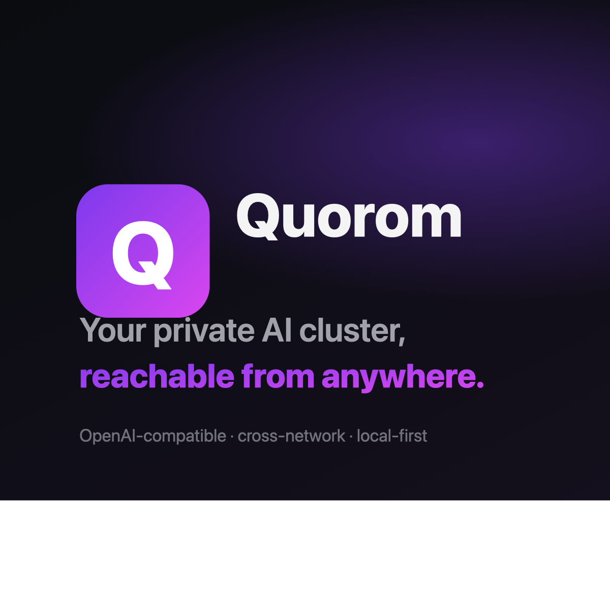

<p align="center">
  
</p>

<h1 align="center">Quorom</h1>

<p align="center">
  <strong>Your private AI cluster, reachable from anywhere.</strong>
</p>

<p align="center">
  <a href="https://github.com/webface/quorom-app/releases/latest">Download</a> ·
  <a href="https://app.quorom.app/install">Install Guide</a> ·
  <a href="https://app.quorom.app/dashboard">Dashboard</a> ·
  <a href="https://app.quorom.app/terms">Terms</a> ·
  <a href="https://app.quorom.app/privacy">Privacy</a>
</p>

---

Quorom turns the machines you already own into one OpenAI-compatible
inference cluster — without VPNs, port forwarding, or networking headaches.

---

## Download

| Platform | Link |
|---|---|
| macOS (universal) | [quorom-macos-universal.zip](https://github.com/webface/quorom-app/releases/latest) |
| macOS (installer) | [quorom-macos-installer.dmg](https://github.com/webface/quorom-app/releases/latest) |
| Windows (amd64) | [quorom-windows-amd64.exe](https://github.com/webface/quorom-app/releases/latest) |

Need help? See the [Install Guide](https://app.quorom.app/install).

## Install

### macOS
1. Download the `.dmg`, open it, drag **Quorom.app** to **Applications**
2. First launch: bypass Gatekeeper — run in Terminal:
   ```
   xattr -dr com.apple.quarantine /Applications/Quorom.app
   ```
   Or: System Settings → Privacy & Security → "Quorom was blocked" → **Open Anyway**
3. Launch Quorom

### Windows
1. Download the `.exe`
2. Run it — if SmartScreen warns, click **More info** → **Run anyway**

---

## What it does

- **Zero-config networking.** Nodes connect outbound to the Quorom relay. No firewalls, no port forwarding, no network configuration.
- **LAN auto-discovery.** Machines on the same network find each other automatically via mDNS — no cloud required for LAN routing.
- **OpenAI-compatible.** Point Cursor, Open WebUI, or curl at `https://api.quorom.app/v1` — it drops in anywhere the OpenAI SDK is used.
- **Use your own hardware.** Your machines' GPUs and RAM become cluster nodes. No model duplication.
- **Local-first.** Models run on hardware you control. The relay only brokers metadata and token streams — it never stores prompts or completions.
- **Auto-updating.** The app checks for updates on launch and can self-update with one click — no manual reinstall.
- **Distributed inference.** Split a model across machines so every node contributes compute to each token.

## Quick start

1. Download and launch Quorom
2. Follow the setup wizard (auto-detects Ollama / LM Studio, offers one-click install)
3. Visit the [web dashboard](https://app.quorom.app/dashboard) to create a cluster and generate an API key
4. In Quorom: **Settings → Cloud Cluster → paste your API key → Connect**
5. The key is saved — Quorom auto-connects on every boot
6. Run Quorom on another machine with the same key to join the cluster
7. Use it from anywhere:

```bash
curl https://api.quorom.app/v1/chat/completions \
  -H "Authorization: Bearer quorom_your_key" \
  -H "Content-Type: application/json" \
  -d '{
    "model": "llama3.1:8b",
    "messages": [{"role":"user","content":"hello"}],
    "stream": true
  }'
```

## Supported backends

Each node can serve inference from any of:
- **Ollama** (auto-installer in the wizard)
- **LM Studio** (Local Server)
- **llama.cpp** (including RPC for distributed inference)
- **MLX** on Apple Silicon
- **vLLM**
- Any other **OpenAI-compatible** HTTP server

## Status

Quorom is in **alpha**.

- ✅ Cross-platform desktop app (macOS, Windows)
- ✅ Relay-routed cluster networking
- ✅ LAN auto-discovery (mDNS) with direct peer-to-peer routing
- ✅ OpenAI-compatible API
- ✅ Secure authentication (API keys + OAuth)
- ✅ Persistent cluster state
- ✅ Distributed inference (model sharding across machines)
- ✅ In-app auto-update (one click, no reinstall)
- ✅ Smart retry + fallback (resilient peer-to-peer chat)
- 🚧 Apple notarization + Windows code signing
- 🚧 Linux desktop builds
- 🚧 Per-cluster usage billing
- 🚧 Team / org management

## Privacy

Quorom is designed to be **local-first**. Your prompts and completions
never touch the relay in persisted form — the relay forwards token
streams in memory and discards them.

Read the full [Privacy Policy](https://app.quorom.app/privacy) and
[Terms of Service](https://app.quorom.app/terms).

## Pricing

Free during alpha. Eventual pricing will be relay-bandwidth based; local
inference on your own hardware will always be free.

## Issues

File bugs and feature requests in this repo's [Issues](https://github.com/webface/quorom-app/issues).

## License

The Quorom app binaries are © 2026 Webfacemedia Inc. and provided free
of charge during the alpha period. Source code is currently proprietary.
